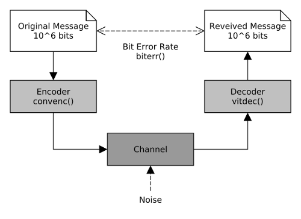

# Study of Decoding Performances of Convolutional codes by MATLAB Simulation.

Mini Project for Aarhus University's [Information Theory and Coding](http://kursuskatalog.au.dk/en/course/60135) course.

The MATLAB code evaluates the performance of different convolutional codes correcting random and burst errors introduced by transmission over a simulated noisy channel.

For detailed information and simulation results please refer to the [PDF report](doc/report.pdf).
